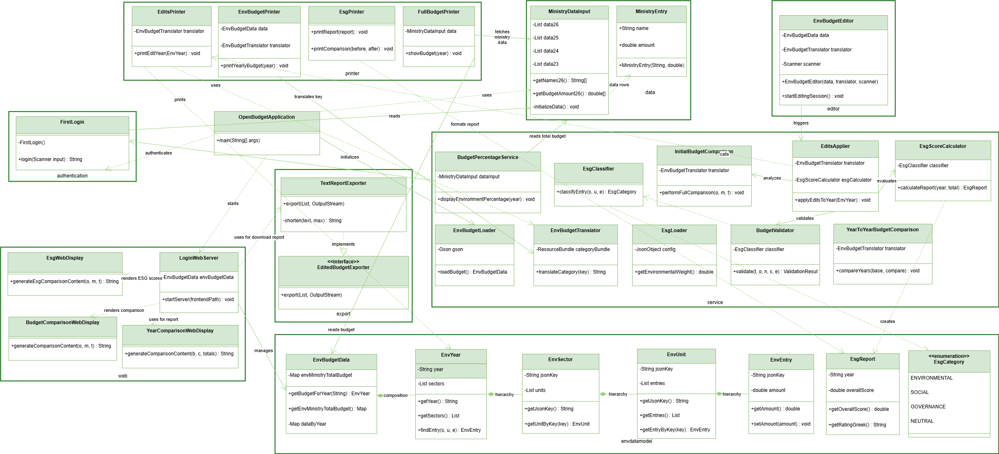

# OpenBudget – [Prime] Minister for a Day  
**Budget Management System**

[](https://openjdk.org/)
[](https://maven.apache.org/)
[](#license)
[](#testing-and-code-coverage)

> *Spinnovators*

OpenBudget is a **command-line and web-based Java application** that allows users to view, edit, and analyze the **Greek state budget**, with a special focus on the **Ministry of Environment and Energy** — as if they were the **Prime Minister for a Day**.

The system supports:
- Budget visualization (2023–2026)
- Interactive budget modifications
- Fiscal & ESG validation rules
- Sustainability scoring
- Chart Visualization
- Budget comparison
- Export Report 
- CLI & Web interfaces

---

## Table of Contents
- [Main Features](#main-features)
- [Purpose](#purpose)
- [Technical Architecture](#technical-architecture-and-components)
- [Repository Structure](#repository-structure)
- [Data Files](#data-files)
- [Installation](#installation-and-compilation)
- [Running the Application](#running-the-application)
- [Usage Guide](#usage-guide)
- [UML Diagram](#uml-diagram)
- [Data Structures & Algorithms](#data-structures--algorithms)
- [Testing](#testing-and-code-coverage)
- [Troubleshooting](#troubleshooting)
- [System Capabilities and Limitations](#system-capabilities-and-limitations)
- [FAQ](#faq)
- [Contributing](#contributing)
- [License](#license)
- [Team](#team---spinnovators)

---

## Main Features

### 1. Budget Overview:
Displays all main categories of the national budget (e.g. Education, Health, Defense, Infrastructure, etc.) for years 2023-2026.
### 2. Data Editing and Updates
Users can input changes directly through the command line or web interface to the Ministry of Environment and Energy. The system allows simulation of revised budget allocations — for instance, increasing investments in renewable energy or reducing permanent assets — and automatically recalculates totals and balances.
### 3. Restriction and Validation Checks
Automatic checks ensure that user modifications comply with fiscal and legal rules (e.g., no negative budgets, total spending cannot exceed total income, warnings for changes exceeding 30%).
### 4. Ministry of Environment and Energy Focus
Special emphasis on environmental policies, green energy funding, and sustainability initiatives. 
### 5. Yearly Budget Comparison
Compare the current budget with previous years' data, highlighting increases or decreases per sector.
### 6. ESG Score Evaluation
Evaluate Environmental, Social, and Governance (ESG) indicators to measure how sustainable and responsible the proposed budget changes are. The system tags budget categories as "GREEN" or "NEUTRAL" and calculates a sustainability score (scale from 0 to 100).
### 7. Updated and Initial Budget Comparison
Compare the new budget, changed by the Minister, with the initial Ministry's of Environment and Energy budget, highlighting increases or decreases per sector, presenting pie charts and top changes.
### 8. Budget Comparison between two selected years 
Direct comparison between any two fiscal years (2023–2026), calculating changes per sector and budget entry.  
Increases and decreases are clearly highlighted, allowing users to identify budget shifts and ESG impact across different years.
### 9. Export Report 
The system provides an export functionalitythat allows users to generate structured reports of all budget changes.  
Budget modifications can be exported in CSV format, making them fully compatible with spreadsheet tools such as Excel.

---

## Purpose
The goal of **OpenBudget** is to encourage critical thinking about how national budgets are structured and how policy decisions influence sustainability, equality, and progress.  
By simulating the decision-making process, users can experience the challenges of real-world governance

> *Step into the role of Prime Minister — for one day.*

---

## Technical Architecture and Components

### 1. **Application Entry Point**
**`OpenBudgetApplication.java`**
- Main entry point of the application
- Invokes `FirstLogin.login()` for user authentication
- Initializes `MinistryDataInput` and `FullBudgetPrinter` objects
- Handles year selection (2023-2026) or exit with `0000`
- Starts embedded HTTP server on port `8080`
- Automatically opens web interface in default browser

---

### 2. **Data Model Layer**
**Package:** `envdatamodel`

| Class | Description |
|-------|-------------|
| `EnvBudgetData.java` | Root container holding all budget data per year with total ministry budget mappings |
| `EnvYear.java` | Represents budget data for a specific year, contains multiple `EnvSector` objects |
| `EnvSector.java` | Represents major policy sectors (e.g., energy, natural resources), contains `EnvUnit` objects |
| `EnvUnit.java` | Represents administrative units (e.g., General Secretariat), contains `EnvEntry` items |
| `EnvEntry.java` | Smallest budget entry (e.g., personnel costs, operational expenses) with mutable amounts |
| `EsgCategory.java` | Enumeration for ESG classification (Environmental, Social, Governance, Neutral) |
| `EsgReport.java` | Complete ESG sustainability report with scores and breakdowns |

---

### 3. **Service Layer**
**Package:** `service`

#### Data Management Services

**`EnvBudgetLoader.java`**
- Reads JSON data from `env_budget_data.json`
- Constructs complete hierarchy: year → sector → unit → entry
- Uses Gson library for robust JSON parsing
- Handles JSON syntax errors and file-not-found exceptions gracefully

**`EnvBudgetTranslator.java`**
- Loads `env_budget_translations.properties`
- Maps JSON keys to official Greek ministry descriptions
- Provides safe translation with fallback mechanism

#### Budget Editing Services

**`EditsApplier.java`**
- Manages interactive editing workflow
- Implements state management for multi-step editing process
- Tracks balance changes and enforces budget equilibrium
- Integrates with `BudgetValidator` for comprehensive validation
- Supports budget comparison functionality
- Presents ESG Score analysis with insights

**`BudgetValidator.java`**
- **CHECK 1:** Prevents negative budget values
- **CHECK 2:** Ensures values don't exceed total ministry budget
- **CHECK 3:** Warns about extreme deviations (>30%) requiring confirmation
- **Smart ESG Rules:**
  - `ESG_ENV_PROTECTION`: Blocks cuts >5% to environmental expenses
  - `ESG_GOV_RESTRICTION`: Blocks increases >10% to governance/bureaucracy
  - `ESG_SOCIAL_PROTECTION`: Blocks cuts >10% to social salaries/benefits
- Provides user-friendly error messages in Greek

#### ESG Evaluation Services

**`EsgClassifier.java`**
- Classifies budget sectors, units, and entries into ESG categories

**`EsgScoreCalculator.java`**
- Calculates ESG sustainability scores using weighted formula

**`EsgLoader.java`**
- Loads ESG configuration from `esg_mappings.json`

**`InitialBudgetComparison.java`**
- Comprehensive budget comparison analysis
- Sector-by-sector breakdown with percentage changes
- Visual ASCII pie charts
- ESG impact analysis
- Recommendations based on changes

---

### 4. **Printer Layer**
**Package:** `printer`

| Class | Description |
|-------|-------------|
| `FullBudgetPrinter.java` | Formats complete state budget with currency formatting and totals |
| `EnvBudgetPrinter.java` | Displays detailed Environment Ministry budget with hierarchical structure |
| `EditsPrinter.java` | Shows updated budget data after modifications |
| `EsgPrinter.java` | Prints formatted ESG sustainability reports to console |

---

### 5. **Export Layer**
**Package:** `export`

| Class | Description |
|-------|-------------|
| `EditedBudgetExporter.java` | Interface defining export contract (Strategy Pattern) |
| `CsvExporter.java` | Exports budget changes to CSV format (Excel compatible with UTF-8 BOM) |
| `TextReportExporter.java` | Generates formatted text reports resembling official government documents |

---

### 6. **Web Layer**
**Package:** `web`

**`LoginWebServer.java`**
- Embedded HTTP server using `com.sun.net.httpserver.HttpServer`
- Serves HTML pages from `src/main/resources/frontend/`
- Authenticates users (Minister/Employee)
- Dynamic budget rendering and injection
- Multi-step state machine for budget editing
- `ThreadLocal` session management for concurrent users
- **Endpoints:**
  - `/login` - User authentication
  - `/minister_statebudget.html` - Full state budget view
  - `/minister_budget.html` - Environment ministry budget
  - `/employee_statebudget.html` - Employee view
  - `/change-budget` - Interactive budget modification
  - `/esg.html` - ESG evaluation dashboard
  - `/download_report` - Export budget changes

**`EsgWebDisplay.java`**
- Generates HTML fragments for ESG reports in web interface

---

### 7. **Authentication Layer**
**Package:** `authentication`

**`FirstLogin.java`**
- Handles login functionality
- Supports Minister (`m1n1st3r`) and Employee (`3mpl0y33`) credentials
- Enforces repeated attempts until valid credentials entered

---

### 8. **Data Layer**
**Package:** `data`

**`MinistryDataInput.java`**
- Contains hardcoded budget data for years 2023-2026
- Provides arrays of ministry names and budget amounts
- Getter methods for fast lookup in CLI

---

##  Repository Structure

```
.github\workflows
├── ci.yml
OpenBudget-app/
├── src/
│   ├── main/
│   │   ├── java/gr/det/spinnovators/
│   │   │       ├── OpenBudgetApplication.java      # Main entry point
│   │   │       ├── authentication/
│   │   │       │   └── FirstLogin.java             # Login authentication
│   │   │       ├── data/
│   │   │       │   └── MinistryDataInput.java      
│   │   │       ├── envdatamodel/                   # Data model layer
│   │   │       │   ├── EnvBudgetData.java
│   │   │       │   ├── EnvYear.java
│   │   │       │   ├── EnvSector.java
│   │   │       │   ├── EnvUnit.java
│   │   │       │   ├── EnvEntry.java
│   │   │       │   ├── EsgCategory.java
│   │   │       │   └── EsgReport.java
│   │   │       ├── service/                        # Business logic
│   │   │       │   ├── EnvBudgetLoader.java
│   │   │       │   ├── EnvBudgetTranslator.java
│   │   │       │   ├── EditsApplier.java
│   │   │       │   ├── BudgetValidator.java
│   │   │       │   ├── EsgClassifier.java
│   │   │       │   ├── EsgScoreCalculator.java
│   │   │       │   ├── EsgLoader.java
│   │   │       │   ├── YeartoYearBudgetComparison.java
│   │   │       │   └── InitialBudgetComparison.java
│   │   │       ├── printer/                        # Console output
│   │   │       │   ├── FullBudgetPrinter.java
│   │   │       │   ├── EnvBudgetPrinter.java
│   │   │       │   ├── EditsPrinter.java
│   │   │       │   └── EsgPrinter.java
│   │   │       ├── export/                         # Data export
│   │   │       │   ├── EditedBudgetExporter.java
│   │   │       │   ├── CsvExporter.java
│   │   │       │   └── TextReportExporter.java
│   │   │       └── web/                            # Web interface
│   │   │           ├── LoginWebServer.java
│   │   │           ├── BudgetComparisonWebDisplay.java
│   │   │           ├── YearComparisonWebDisplay.java
│   │   │           └── EsgWebDisplay.java
│   │   └── resources/
│   │       └── frontend/                                       # HTML interface
│   │           ├── change-budget.html                         
│   │           ├── comparison.html                             
│   │           ├── employee_budget.html                       
│   │           ├── employee_statebudget.html                   
│   │           ├── esg.html                                   
│   │           ├── login.html                                 
│   │           ├── minister_budget.html                     
│   │           ├── minister_statebudget.html                  
│   │           └── year-comparison.html                        
│   │       ├── env_budget_data.json                            
│   │       ├── env_budget_translations.properties             
│   │       └── esg_mappings.json                              
│   └── test/
│       └── java/gr/det/spinnovators/                           # Unit tests
│           ├── authentication/                                 # Authentication tests
│           │   └── FirstLoginTest.java                        
│           ├── data/                                           # Data tests
│           │   └── MinistryDataInputTest.java                 
│           ├── editor/                                         # Editor tests
│           │   └── EnvBudgetEditorTest.java                   
│           ├── envdatamodel/                                  
│           │   ├── EnvBudgetDataTest.java                      
│           │   ├── EnvEntryTest.java                          
│           │   ├── EnvSectorTest.java                          
│           │   ├── EnvUnitTest.java                          
│           │   ├── EnvYearTest.java                           
│           │   ├── EsgCategoryTest.java                        
│           │   └── EsgReportTest.java                          
│           ├── export/                                         # Export tests
│           │   ├── EditedBudgetExporterTest.java               
│           │   └── TextReportExporterTest.java                
│           ├── printer/                                        # Printer tests
│           │   ├── EditsPrinterTest.java                       
│           │   ├── EnvBudgetPrinterTest.java                   
│           │   ├── EsgPrinterTest.java                         
│           │   └── FullBudgetPrinterTest.java                  
│           ├── service/                                        # Service tests
│           │   ├── BudgetPercentageServiceTest.java            
│           │   ├── BudgetValidatorTest.java                    
│           │   ├── EditsApplierTest.java                       
│           │   ├── EnvBudgetLoaderTest.java                    
│           │   ├── EnvBudgetTranslatorTest.java                
│           │   ├── EsgClassifierTest.java                      
│           │   ├── EsgLoaderTest.java                          
│           │   ├── EsgScoreCalculatorTest.java                 
│           │   ├── InitialBudgetComparisonTest.java            
│           │   └── YeartoYearBudgetComparisonTest.java         
│           └── web/                                            # Web tests
│               ├── EsgWebDisplayTest.java                      
│               ├── LoginWebServerTest.java                     
│               └── OpenBudgetApplicationTest.java              # Main application test
├── target/                                                     # Build output
│  | └── classes/                                               # Compiled classes
│  |    └── frontend/                                           # Compiled resources
│  |         └── [HTML files]                                   # Built HTML files
|  ├── pom.xml                                                  # Maven configuration
├── .gitignore
├── images                                                      # Visual Documentation Assets Folder - Useful for UML diagram display
│  | └── uml.diagram.png                                      
└── README.md                                                   # Project documentation - This file

```

## Architecture Overview

### Main Application Layer
- **OpenBudgetApplication.java**: Entry point of the application

### Service Layer
Core business logic services:
- **EsgLoader.java**: Loads ESG (Environmental, Social, Governance) data
- **EsgScoreCalculator.java**: Calculates ESG scores for budget items
- **InitialBudgetComparison.java**: Compares current budget with initial state
- **YearToYearBudgetComparison.java**: Compares budgets across different years

### Web Layer
Web interface and server components:
- **LoginWebServer.java**: Handles authentication and server initialization
- **BudgetComparisonWebDisplay.java**: Displays budget comparisons
- **YearComparisonWebDisplay.java**: Displays year-over-year comparisons
- **EsgWebDisplay.java**: Displays ESG analysis and reports

### Frontend Resources
HTML interfaces for different user roles:
- **login.html**: Authentication page
- **minister_statebudget.html**: Minister view of state budget
- **minister_budget.html**: Minister view of department budget
- **employee_statebudget.html**: Employee view of state budget
- **employee_budget.html**: Employee view of department budget
- **change-budget.html**: Budget editing interface
- **comparison.html**: Budget comparison view
- **year-comparison.html**: Year-over-year comparison view
- **esg.html**: ESG analysis dashboard

### Configuration Files
- **env_budget_data.json**: Budget data storage
- **env_budget_translations.properties**: Greek language translations
- **esg_mappings.json**: ESG category mappings and configuration

### Test Suite
Comprehensive unit tests organized by functionality:
- **authentication/**: Login and authentication tests
- **data/**: Data input and processing tests
- **editor/**: Budget editing functionality tests
- **envdatamodel/**: Data model validation tests
- **export/**: Export functionality tests
- **printer/**: Output formatting tests
- **service/**: Business logic tests
- **web/**: Web interface and server tests

## Key Features
1. Role-based access control (Minister/Employee)
2. Budget comparison and analysis
3. ESG scoring and reporting
4. Multi-year budget tracking
5. Data export capabilities
6. Greek language support

---

##  Data Files

### 1. **Budget Data** (`env_budget_data.json`)

Contains hierarchical budget data per year with the following structure:

- **Top Level:** Fiscal year (2023-2026)
- **Level 2:** Policy sectors (e.g., `executive_coordination_and_investments`)
- **Level 3:** Administrative units (e.g., `ministerial_secretariats_and_offices`)
- **Level 4:** Budget entries (e.g., `personnel_costs`, `permanent_assets`)

**Example:**
```json
{
  "env_ministry_total_budget": {
    "2025": 2341227000.00
  },
  "data_by_year": {
    "2025": {
      "executive_coordination_and_investments": {
        "ministerial_secretariats_and_offices": {
          "personnel_costs": 2256000.00,
          "purchase_of_goods_and_services": 1725000.00,
          "permanent_assets": 15000.00
        }
      }
    }
  }
}
```

---

### 2. **Translations** (`env_budget_translations.properties`)

Maps English JSON keys to official Greek ministry descriptions:
```properties
executive_coordination_and_investments=ΕΠΙΤΕΛΙΚΟΣ ΣΥΝΤΟΝΙΣΜΟΣ ΚΑΙ ΕΠΕΝΔΥΣΕΙΣ ΥΠΟΥΡΓΕΙΟΥ ΠΕΡΙΒΑΛΛΟΝΤΟΣ ΚΑΙ ΕΝΕΡΓΕΙΑΣ
personnel_costs=Παροχές σε εργαζομένους
purchase_of_goods_and_services=Αγορές αγαθών και υπηρεσιών
```

---

### 3. **ESG Configuration** (`esg_mappings.json`)

Defines ESG evaluation rules:

- **sectors:** Classification of sectors (ENVIRONMENTAL, SOCIAL, GOVERNANCE, MIXED)
- **entries:** Classification of entry types (SOCIAL, GOVERNANCE, CONTEXT_DEPENDENT)
- **weights:** ESG score weights (Environmental: 0.40, Social: 0.30, Governance: 0.30)
- **thresholds:** Rating thresholds (Excellent: 80, Good: 60, Moderate: 40, Poor: 20)
- **display_settings:** UI configuration
- **improvement_suggestions:** Score thresholds for recommendations
- **localization:** Greek/English translations for ratings

**Example:**
```json
{
  "sectors": {
    "natural_environment_and_water_protection": "ENVIRONMENTAL",
    "executive_coordination_and_investments": "GOVERNANCE"
  },
  "entries": {
    "personnel_costs": "SOCIAL",
    "purchase_of_goods_and_services": "GOVERNANCE"
  },
  "weights": {
    "environmental": 0.40,
    "social": 0.30,
    "governance": 0.30
  }
}
```

---

## Installation and Compilation

### Prerequisites

- **Java:** Version 21 or higher
- **Maven:** Version 3.8+
- **Git:** For cloning the repository

### Step 1: Clone the Repository
```bash
git clone https://github.com/yourusername/openbudget.git
cd openbudget/OpenBudget-app
```

### Step 2: Compile the Project
```bash
mvn clean compile
```

### Step 3: Build Executable JAR
```bash
mvn clean package
```

This creates `OpenBudget-app-1.0-SNAPSHOT.jar` in the `target/` directory.

---

## Running the Application

### Method 1: Using Maven
```bash
mvn exec:java -Dexec.mainClass="gr.det.spinnovators.OpenBudgetApplication"
```

### Method 2: Using JAR
```bash
java -jar target/OpenBudget-app-1.0-SNAPSHOT.jar
```

### Method 3: Using IDE

- Open project in IntelliJ IDEA / Eclipse / NetBeans
- Run `OpenBudgetApplication.java` main method

The application will:
1. Start the embedded HTTP server on port `8080`
2. Attempt to open `http://localhost:8080/login.html` in your default browser
3. Provide a terminal interface as fallback

---

## Usage Guide

### Web Interface

#### **Login**
- Navigate to: `http://localhost:8080/login.html`
- Enter credentials:

| Role | Username | Password |
|------|----------|----------|
| Minister | `Minister` | `m1n1st3r` |
| Employee | Any name | `3mpl0y33` |

---

#### **View State Budget**
1. After login, select **"View State Budget"**
2. Choose fiscal year (2023-2026)
3. View formatted budget table with ministry allocations

---

#### **View Ministry Budget** (Environment & Energy)
1. Select **"View Ministry Budget"**
2. Choose fiscal year
3. View detailed hierarchical breakdown:
   - Sector → Unit → Entry

---

#### **Edit Budget** (Minister Only)
1. Navigate to **"Change Budget"**
2. **Select Year:** Choose 2025 or 2026
3. **Select Sector:** Pick policy sector (e.g., Energy Management)
4. **Select Unit:** Choose administrative unit
5. **Select Entry:** Pick specific budget item
6. **Enter New Value:** Type new amount
7. **System Validates:**
   -  Checks for negative values
   -  Ensures within total budget
   -  Applies ESG rules (Environmental protection, Governance restrictions, Social protection)
   -  Warns about extreme deviations (>30%)
8. **Balance Tracking:** System displays running balance
9. **Termination:** Can only exit when balance = 0 (budget equilibrium achieved)

---

#### **ESG Evaluation**
- After budget changes, view ESG impact analysis
- System calculates:
  - **Environmental Score** (40% weight)
  - **Social Score** (30% weight)
  - **Governance Score** (30% weight)
  - **Overall weighted score**
- Displays comparison with initial budget
- Provides improvement suggestions

---

#### **Updated and Initial Budget Comparison**
- Compare the new budget with the initial Ministry's of Environment and Energy budget
- Ιncreases or decreases highlighted per sector, presenting pie charts and top changes.

---

#### **Budget Comparison between two selected years**
- Direct comparison between any two fiscal years (2023–2026) 
- Increases and decreases are clearly highlighted, allowing users to identify budget shifts and ESG impactacross different years.

---

#### **Export Report**
- Download budget changes as text report
- Format: Official government document style with Greek headers

---

###  Terminal Interface

#### **Login**
```
Εισάγετε το όνομα χρήστη σας: Minister
Εισάγετε τον κωδικό σας: m1n1st3r
Επιτυχής σύνδεση! Καλωσήρθατε κύριε Υπουργέ.
```

#### **View Budget**
```
Ποιού έτους τον προϋπολογισμό θα θέλατε να δείτε; (2023, 2024, 2025 ή 2026): 2025
```

#### **Edit Budget** (Ministry of Environment & Energy)
Follow the interactive prompts:
1. Select fiscal year
2. Select sector
3. Select unit
4. Search for entry by name
5. Enter new amount
6. System validates and updates balance
7. Continue until balance = 0

#### **Exit**
```
Type: 0000
```

#### **ESG Evaluation**
- After budget changes, view ESG impact analysis
- System calculates:
  - **Environmental Score** (40% weight)
  - **Social Score** (30% weight)
  - **Governance Score** (30% weight)
  - **Overall weighted score**
- Displays comparison with initial budget
- Provides improvement suggestions

---

#### **Updated and Initial Budget Comparison**
- Compare the new budget with the initial Ministry's of Environment and Energy budget
- Ιncreases or decreases highlighted per sector, presenting pie charts and top changes.

---

#### **Budget Comparison between two selected years**
- Direct comparison between any two fiscal years (2023–2026) 
- Increases and decreases are clearly highlighted, allowing users to identify budget shifts and ESG impactacross different years.

---

## UML Diagram

**This is our UML class diagram illustrating the application's structure, including core classes, attributes, methods, and their relationships.**





**Key Relationships:**
- `OpenBudgetApplication` → `FirstLogin`, `MinistryDataInput`, `FullBudgetPrinter`, `LoginWebServer`
- `EnvBudgetData` → `EnvYear` (1:many)
- `EnvYear` → `EnvSector` (1:many)
- `EnvSector` → `EnvUnit` (1:many)
- `EnvUnit` → `EnvEntry` (1:many)
- `EditsApplier` → `BudgetValidator`, `EsgScoreCalculator`, `InitialBudgetComparison`
- `EsgScoreCalculator` → `EsgClassifier`, `EsgReport`
- `LoginWebServer` → `EnvBudgetLoader`, `EditsApplier`, `EsgWebDisplay`

---

## Data Structures and Algorithms

### Data Structures

#### **1. Hierarchical Tree Structure**
**Purpose:** Represents budget organization from year → sector → unit → entry
```
EnvBudgetData (Root)
  └── Map<String, EnvYear>
        └── EnvYear
              └── List<EnvSector>
                    └── List<EnvUnit>
                          └── List<EnvEntry>
```

**Advantages:**
- Natural representation of organizational hierarchy
- Easy navigation and searching
- Efficient updates at leaf nodes

**Complexity:**
- **Search:** O(sectors × units × entries) in worst case
- **Update:** O(1) once entry is located
- **Memory:** O(total entries)

---

#### **2. HashMap** (Java's `Map`)

**Used in:**
- `EnvBudgetData`: Maps year → `EnvYear` object
- `EnvBudgetTranslator`: Maps JSON keys → Greek translations
- `EsgLoader`: Configuration lookup

**Advantages:**
- O(1) average lookup time
- Efficient for frequent access patterns

---

#### **3. ArrayList** (Java's `List`)

**Used in:**
- Storing collections of sectors, units, entries
- Change logs for export functionality

**Advantages:**
- Dynamic sizing
- Sequential access O(1)
- Good cache locality

---

#### **4. ThreadLocal Storage**

**Used in:** `LoginWebServer` for session management

**Purpose:** Maintains separate state for concurrent web users

**Advantages:**
- Thread-safe without explicit synchronization
- Isolated user sessions

---

### Algorithms

#### **1. Budget Validation Algorithm**
**Location:** `BudgetValidator.validate()`

**Steps:**
1. Check if value is negative → **REJECT**
2. Check if value exceeds total budget → **REJECT**
3. Calculate percentage deviation: `|(new - old) / old| × 100`
4. Classify entry into ESG category (Environmental/Social/Governance)
5. Apply category-specific rules:
   - **Environmental:** Reject cuts >5%
   - **Governance:** Reject increases >10%
   - **Social:** Reject cuts >10%
6. If generic deviation >30% → **WARN** and require confirmation
7. Otherwise → **ACCEPT**

**Complexity:** O(1)

---

#### **2. ESG Score Calculation Algorithm**
**Location:** `EsgScoreCalculator.calculateReport()`

**Steps:**
1. Initialize category totals: `{Environmental: 0, Social: 0, Governance: 0, Neutral: 0}`
2. For each Sector → Unit → Entry:
   - Classify entry using `EsgClassifier`
   - Add amount to corresponding category total
3. Calculate individual scores:
   - `E_score = (environmental_total / total_budget) × 100`
   - `S_score = (social_total / total_budget) × 100`
   - `G_score = (governance_total / total_budget) × 100`
4. Calculate weighted overall score:
   - `Overall = (E_score × 0.40) + (S_score × 0.30) + (G_score × 0.30)`
5. Determine rating based on thresholds:
   - ≥80: **Excellent**
   - ≥60: **Good**
   - ≥40: **Moderate**
   - ≥20: **Poor**
   - <20: **Critical**

**Complexity:** O(S × U × E) where S=sectors, U=units per sector, E=entries per unit

---

#### **3. Budget Search Algorithm**
**Location:** `EnvYear.findEntry()`

**Steps:**
1. Search for sector with matching key (linear search through list)
2. If sector found, search for unit within that sector
3. If unit found, search for entry within that unit
4. Return entry or `null` if any step fails

**Complexity:** O(S + U + E) where S=sectors, U=units, E=entries

---

#### **4. JSON Parsing Algorithm**
**Location:** `EnvBudgetLoader.loadBudget()`

**Steps:**
1. Load JSON file from resources
2. Parse root object using Gson
3. Extract `data_by_year` map
4. For each year:
   - Extract sectors map
   - For each sector:
     - Extract units map
     - For each unit:
       - Extract entries map
       - Create `EnvEntry` objects
     - Create `EnvUnit` with entries list
   - Create `EnvSector` with units list
5. Create `EnvYear` with sectors list
6. Build `EnvBudgetData` with years map

**Complexity:** O(Y × S × U × E) where Y=years

---

#### **5. Balance Tracking Algorithm**
**Location:** `EditsApplier.applyEditsToYear()`

**Maintains:** `currentBalance = Σ(oldValues) - Σ(newValues)`

**Steps:**
1. Initialize: `currentBalance = 0`
2. On each edit:
   - `offset = oldValue - newValue`
   - `currentBalance += offset`
3. Before allowing termination:
   - Check: `|currentBalance| < 0.01` (accounting for floating-point precision)
   - If **true**: Allow exit
   - If **false**: Display required adjustment and prevent exit

**Complexity:** O(1) per update

---

## Testing and Code Coverage

### JUnit 5 - Running Tests
**Tests cover:**
- Budget data loading (JSON & ESG configuration)
- Budget modification and validation logic
- ESG classification and score calculation
- Export functionality (CSV and text reports)
- Budget Comparison across years/versions
- Web interface components

#### **Run All Tests**
```bash
mvn test
```

#### **Run Specific Test Class**
```bash
mvn test -Dtest=EnvBudgetLoaderTest
```

#### **JaCoCo – Code Coverage**
- **Measures**:
  - Class coverage
  - Method coverage
  - Branch coverage
- **Generate** coverage report:
```bash
mvn clean test jacoco:report
```
Coverage report located at: `target/site/jacoco/index.html`

---

### Test Coverage Summary

| Package | Classes Tested | Coverage |
|---------|----------------|----------|
| `authentication` | `FirstLoginTest` | Login flows |
| `data` | `MinistryDataInputTest` | Data integrity |
| `envdatamodel` | 7 test classes | Model completeness |
| `export` | `CsvExporterTest`, `TextReportExporterTest` | Export formats |
| `printer` | 4 test classes | Output formatting |
| `service` | 7 test classes | Business logic |
| `web` | `EsgWebDisplayTest`, `LoginWebServerTest` | Web functionality |

---

### Additional Technical Documentation 
> *Code Quality Tools*

#### **Checkstyle**
```bash
mvn checkstyle:check
```
- **Enforces** the Google Java Style Guide
- **Validates**:
  - Class, method, and variable naming conventions
  - Proper indentation and formatting
  - Presence and correctness of JavaDoc comments for public APIs

#### **SpotBugs**
```bash
mvn spotbugs:check
```
- **Detects**:
  - Potential runtime errors
  - Null pointer dereference risks
  - Incorrect use of collections and object comparisons
  - Performance and maintainability issues

#### **JavaDoc Code Documentation**
The codebase is **fully documented using JavaDoc**, enabling easier understanding, maintenance, and extension of the system.
JavaDoc documentation includes:
- Clear descriptions of each class’s responsibility
- Detailed explanations of method parameters and return values
- Business rule clarifications for complex logic
- Generate JavaDoc documentation:
```bash
mvn javadoc:javadoc
```
Generated documentation is available at: `target/site/apidocs/`

---

### Example Test: ESG Calculation
```java
@Test
void testCalculateReport() {
    // Create test data
    EnvEntry e1 = new EnvEntry("personnel_costs", 1000.0); // SOCIAL
    EnvEntry e2 = new EnvEntry("credits_under_allocation", 2000.0); // ENVIRONMENTAL
    
    // ... create hierarchy ...
    
    // Calculate ESG report
    EsgReport report = calculator.calculateReport(year2025, 10000.0);
    
    // Verify scores
    assertEquals(20.0, report.getEnvironmentalScore(), 0.001); // 2000/10000 * 100
    assertEquals(10.0, report.getSocialScore(), 0.001);        // 1000/10000 * 100
    assertEquals(12.5, report.getOverallScore(), 0.001);       // Weighted average
}
```

---

### Maven Configuration (pom.xml)
- Maven project configuration for OpenBudget-app.
- The Project Object Model (pom.xml) manages the project's dependencies and build process.
- Java 17, dependencies for Gson and JUnit, plugins for testing and execution.

---

## Troubleshooting

### Port 8080 Already in Use
```bash
# Find process using port 8080
lsof -i :8080

# Kill the process
kill -9 <PID>

# Or change port in LoginWebServer.java (line XX)
```

### Frontend Directory Not Found
```bash
# Verify path exists
ls src/main/resources/frontend/

# If running from different directory
cd OpenBudget-app
```

### JSON File Not Loading
- Check file encoding: Must be **UTF-8**
- Validate JSON syntax: Use [jsonlint.com](https://jsonlint.com)
- Ensure file location: `src/main/resources/env_budget_data.json`

### Maven Build Fails
```bash
# Clear local repository cache
mvn clean install -U

# Skip tests if needed
mvn clean package -DskipTests
```

---

## System Capabilities and Limitations

### Capabilities

-  **Budget Review:** Displays budget data for 2023-2026
-  **Editing Functionality:** Allows selection and modification of any budget entry
-  **Real-time Changes:** Immediate reflection in in-memory data structure
-  **Localization:** Greek translations for all budget categories
-  **Web & CLI Interface:** Dual-mode operation for flexibility
-  **Balance Tracking:** Maintains fiscal equilibrium during editing
-  **State Machine Editing:** Multi-step guided workflow
-  **ESG Evaluation:** Sustainability scoring with weighted formula
-  **Smart Validation:** ESG-aware rules protecting environmental and social budgets
-  **Budget Comparison:** Detailed side-by-side comparison of the Ministry’s budget across different years or budget versions.
-  **Export Functionality:** CSV and text report generation
-  **Concurrent Users:** ThreadLocal session management (web interface)
---

###  Known Limitations

| Limitation | Impact | Workaround |
|------------|--------|-----------|
| **No Persistence** | Changes lost on restart | Export to CSV before closing |
| **Single Ministry Editing** | Only Environment Ministry editable | Full state budget view-only |
| **Session Isolation** | No collaboration | Use export/import for team work |
| **Budget Balance Required** | Cannot exit until balanced | Track balance carefully |
| **Locale Dependency** | Greek-language UI only | Translations file extensible |

---

## FAQ

**Q: Can I add new ministries to edit?**  
A: Currently only Environment Ministry supports editing. To extend, modify `env_budget_data.json` and add corresponding sectors.

**Q: Are changes saved permanently?**  
A: No, changes are in-memory only. Use CSV export to save modifications.

**Q: Can multiple users edit simultaneously?**  
A: Yes in web interface (isolated sessions), but no collaboration features.

**Q: Why can't I exit editing?**  
A: Budget must be balanced (total changes = 0). Check the balance indicator.

**Q: How is ESG score calculated?**  
A: Weighted formula: `E×0.40 + S×0.30 + G×0.30`. See [ESG Calculation Algorithm](#2-esg-score-calculation-algorithm).

---

## Contributing

This is an educational project, but we welcome feedback!

### Reporting Issues
- Use [GitHub Issues](https://github.com/yourusername/openbudget/issues)
- Include error logs and steps to reproduce

### Code Style
- Follow [Google Java Style Guide](https://google.github.io/styleguide/javaguide.html)
- Run Checkstyle: `mvn checkstyle:check`
- Run SpotBugs: `mvn spotbugs:check`

### Pull Requests
1. Fork the repository
2. Create feature branch: `git checkout -b feature/amazing-feature`
3. Commit changes: `git commit -m 'Add amazing feature'`
4. Push to branch: `git push origin feature/amazing-feature`
5. Open Pull Request

---

##  License

This project is developed for **educational purposes** as part of the **Java Programming course** at the Department of Management Science and Technology.

**Academic Use Only** - Not for commercial distribution.

---

##  Team - Spinnovators

Developed by the **Spinnovators** team for academic coursework.

---

## OpenBudget - Be Prime Minister for a Day!
